# SIXLV BALATRO PACK

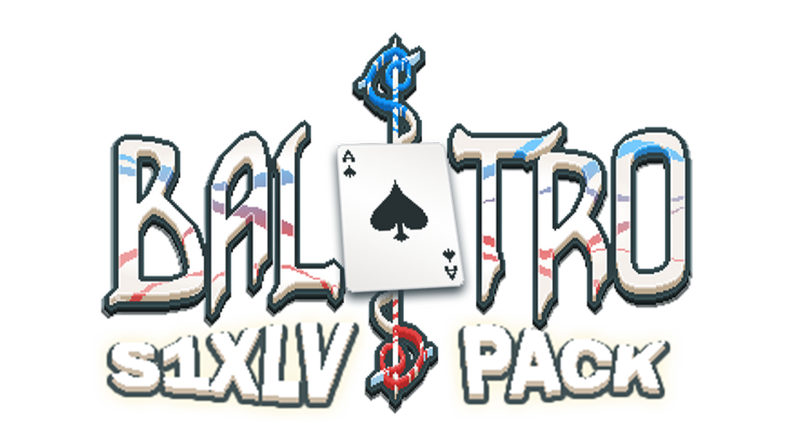

[English](#english) | [简体中文](#简体中文)

## English

**Current version:** `v0.1.7`

SIXLV BALATRO PACK is a vanilla-style content and balance mod for *Balatro*.

It adds four decks and two high-difficulty Stakes, while adjusting selected vanilla Jokers, Vouchers, and high-Stake rules. The goal is to preserve the feel of the base game while opening up more viable builds and alternative starting strategies.

The mod is still being tested and refined. Current values are not final.

## v0.1.7 Update

- Icebound Deck now gains `+3` hands per round instead of `+2`.
- Matador's cost has been reduced from `$10` to `$8`.
- Hanging Chad's cost has been increased from `$4` to `$5`.
- Faceless Joker now gives `$6` instead of `$8` when its discard condition is met.
- Inferno Deck's Ante 10 base score is now `240,000 / 500,000 / 1,000,000 / 2,000,000` across the White, Green, Purple, and Joker scaling tiers.
- Inferno Deck shop Jokers, Buffoon Pack choices, and Jokers created by Judgement now use a `60% / 25% / 15%` Common/Uncommon/Rare split. Other Joker-generation sources are unchanged.
- Fixed Matador failing to trigger against The Tooth because played cards had not entered the play area when the Boss callback began.
- Matador now triggers once after The Manacle's entry penalty and once after Amber Acorn finishes its Joker shuffle.

---

## Vanilla Content Changes

### Jokers

| Image | Joker | Change |
| --- | --- | --- |
|  | Greedy Joker | Matching scored suits now give `+4` Mult instead of `+3` Mult. |
|  | Lusty Joker | Matching scored suits now give `+4` Mult instead of `+3` Mult. |
|  | Wrathful Joker | Matching scored suits now give `+4` Mult instead of `+3` Mult. |
|  | Gluttonous Joker | Matching scored suits now give `+4` Mult instead of `+3` Mult. |
| 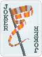 | Banner | Each remaining discard now gives `+40` Chips instead of `+30`. |
| 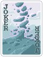 | Mystic Summit | Having no discards remaining now gives `+150` Chips instead of `+15` Mult. |
| 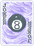 | 8 Ball | Each scored 8 has a `1 in 4` chance to create The Fool if there is room in the consumable area. |
|  | Scary Face | Each scored face card now gives `+40` Chips instead of `+30`. |
|  | Scholar | Now Common; each scored Ace gives `+20` Chips and `+5` Mult instead of `+20` Chips and `+4` Mult. |
|  | Hologram | Gains `X0.2` Mult per playing card added to the deck instead of `X0.25`. |
| 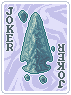 | Arrowhead | Each scored Spade now gives `+40` Chips instead of `+50`. |
|  | Green Joker | Starts at `+0` Mult; gains `+1` Mult per hand played and loses `2` Mult per discard, with a minimum of `0`. |
|  | Mail-In Rebate | Each discarded card of the listed rank now gives `$4` instead of `$5`. |
|  | Faceless Joker | Discarding at least 3 face cards now gives `$6` instead of `$5`. |
|  | Hanging Chad | Rarity changed from Common to Uncommon; costs `$5`. |
|  | Vampire | Gains `X0.15` Mult per scored Enhanced Card instead of `X0.1`. |
| 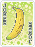 | Gros Michel | Its end-of-round extinction chance is now `1 in 10` instead of `1 in 6`. |
| 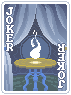 | Séance | Playing a Straight Flush creates a random Negative Spectral card, even when the consumable area is full. |
| 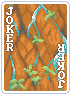 | Erosion | Gains `+5` Mult per card missing from the full deck instead of `+4`. |
|  | Hiker | Costs `$7`; scored cards permanently gain `+1` Mult instead of `+5` Chips. |
|  | Loyalty Card | Rarity changed from Uncommon to Common. |
| 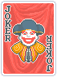 | Matador | Rare, costs `$8`, and gives `$8` per trigger. |
| 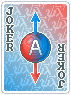 | Superposition | Now Rare and costs `$10`; a Straight containing an Ace creates a Negative copy of the last Tarot or Planet card used. |
|  | Red Card | Skipping a Booster Pack now adds `+4` Mult instead of `+3`. |
| 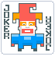 | Square Joker | Starts with `+16` Chips and continues to gain `+4` Chips per qualifying hand. |
| 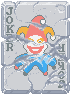 | Stone Joker | Each Stone Card in the full deck now gives `+50` Chips instead of `+25`. |
|  | Throwback | Gains `X0.5` Mult per Blind skipped this run instead of `X0.25`. |
| 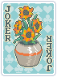 | Flower Pot | Now Rare and costs `$8`; scored cards containing 2, 3, or 4 suits give `X1.25`, `X2.5`, or `X4` Mult respectively. |
| 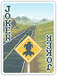 | Hit the Road | Gains `X0.75` Mult per discarded Jack instead of `X0.5`. |
| 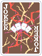 | The Family | Four of a Kind now gives `X5` Mult instead of `X4`. |
|  | The Tribe | A Flush now gives `X2.5` Mult instead of `X2`. |
|  | Satellite | Gives `$2` at the end of the round for each unique Planet card used this run instead of `$1`. |
| 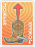 | Bootstraps | Gives `+3` Mult per `$5` held instead of `+2`. |
| 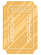 | Golden Ticket | Each played Gold Card that scores gives `$5`. |
| 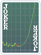 | To the Moon | On Gold Stake, gives an additional `$2` of interest for every `$10` held. |

### Vanilla Stakes

| Image | Stake or Voucher | Change |
| --- | --- | --- |
|  | Blue Stake | No longer removes a discard; instead enables Perishable Jokers. |
|  | Orange Stake | Enables Rental Jokers. |
|  | Gold Stake | Gives `$2` of interest per `$10` held, with a base interest cap of `$4`. |
|  | Seed Money | On Gold Stake, raises the interest threshold to `$40` and the interest cap to `$8`. |
|  | Money Tree | On Gold Stake, raises the interest threshold to `$80` and the interest cap to `$16`. |

### Vouchers

| Image | Voucher | Change |
| --- | --- | --- |
|  | Magic Trick | Playing cards offered in the shop are always Enhanced Cards and may have Bonus, Mult, Wild, Glass, Steel, Stone, Gold, or Lucky enhancements. |
|  | Illusion | Enhanced Cards offered in the shop always receive an Edition, a Seal, or both. |

---

## New Stakes

### Australium Stake


Australium Stake is added after Gold Stake. Compatible Jokers in the shop have a `30%` chance to receive the Bulky sticker.

- Uses two Joker slots.
- Compatible effects trigger one additional time.
- Some retrigger, utility, and Legendary Jokers cannot receive Bulky.

### Joker Stake


Joker Stake includes every Australium Stake rule and increases the base score requirement for each Ante.

| Ante | Base score |
| ---: | ---: |
| 1 | 300 |
| 2 | 1,100 |
| 3 | 3,900 |
| 4 | 12,000 |
| 5 | 37,000 |
| 6 | 100,000 |
| 7 | 200,000 |
| 8 | 400,000 |

Score requirements continue to rise after Ante 8.

---

## New Decks

### Cartomancer Deck


A Tarot-focused deck with no Planet cards or Blue Seals.

#### Tarot Changes

| Image | Tarot | Change |
| --- | --- | --- |
|  | The Magician | Maximum selected cards increased from `2` to `3`. |
|  | The High Priestess | No longer creates Planet cards; instead levels up the last played poker hand by `2` levels. |
|  | The Empress | Maximum selected cards increased from `2` to `3`. |
| 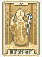 | The Hierophant | Maximum selected cards increased from `2` to `3`. |
|  | The Lovers | Maximum selected cards increased from `1` to `2`. |
| 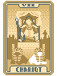 | The Chariot | Maximum selected cards increased from `1` to `2`. |
|  | Justice | Maximum selected cards increased from `1` to `2`. |
| 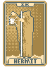 | The Hermit | Money-doubling cap increased from `$20` to `$30`. |
| 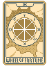 | Wheel of Fortune | Success chance increased from `1 in 4` to `1 in 3`. |
| 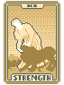 | Strength | Maximum selected cards increased from `2` to `4`. |
| 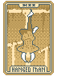 | The Hanged Man | Maximum destroyed cards increased from `2` to `3`. |
| 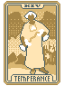 | Temperance | Payout cap increased from `$50` to `$80`. |
| 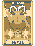 | The Devil | Maximum selected cards increased from `1` to `2`. |
|  | The Tower | Maximum selected cards increased from `1` to `2`. |
|  | The Star | Maximum converted cards increased from `3` to `4`. |
|  | The Moon | Maximum converted cards increased from `3` to `4`. |
| 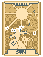 | The Sun | Maximum converted cards increased from `3` to `4`. |
|  | The World | Maximum converted cards increased from `3` to `4`. |
|  | Judgement | Base cost changed to `$5`; creates up to `2` random Jokers, limited by available Joker slots. |

### Icebound Deck


- `+3` hands per round.
- Starts with `0` discards.
- Earns `$1` for every `2` hands remaining; an unmatched remaining hand gives no payout.

### Small Deck

 

- Starts with `26` cards: one complete A-K set in Clubs and one complete A-K set in Diamonds.
- After scoring and destruction effects resolve, surviving played cards are randomized and placed at the bottom of the deck.
- Discarded cards continue to use the vanilla discard pile.

### Inferno Deck


- `+4` hand size.
- Starts with Greedy Joker, Lusty Joker, Wrathful Joker, and Gluttonous Joker.
- Starts `+2` Antes ahead.
- The poker hand played on the first hand of the run permanently gains `2` levels and scores at its upgraded level immediately.
- Shop Jokers, Buffoon Pack choices, and Jokers created by Judgement use a `60% / 25% / 15%` Common/Uncommon/Rare split. Other Joker-generation sources retain their normal rarity odds.

---

## Requirements

- Steam version of *Balatro*
- [Lovely](https://github.com/ethangreen-dev/lovely-injector)
- [Steamodded](https://github.com/Steamodded/smods) `1.0.0~`

## Installation

1. Install Lovely and Steamodded.
2. Download and extract the release archive.
3. Place the `SIXLVBalatroPack` folder in:

```text
%AppData%\Balatro\Mods\
```

4. Launch the game and confirm that **SIXLV BALATRO PACK** appears in the Mods list.

---

## 简体中文

**当前版本：** `v0.1.7`

SIXLV BALATRO PACK 是一个以《Balatro》原版美术与玩法为基础的内容及平衡调整模组。

模组新增四副牌组、两级高难度注，并调整部分原版小丑牌、优惠券与高难度规则，目标是在保留原版体验的同时提供更多可用构筑和不同的开局方式。

当前版本仍在持续测试与调整，现有数值不代表最终版本。

## v0.1.7 更新

- 冻洋牌组每回合增加的出牌次数由 `+2` 提高至 `+3`。
- 斗牛士的售价由 `$10` 降低至 `$8`。
- 未断选票的售价由 `$4` 提高至 `$5`。
- 无面小丑满足弃牌条件时的收益由 `$8` 降低至 `$6`。
- 炼狱牌组第 10 底注的基础分数按照白、绿、紫和小丑注缩放档位调整为 `240,000 / 500,000 / 1,000,000 / 2,000,000`。
- 炼狱牌组中，商店自然生成的小丑牌、小丑包候选以及《审判》生成的小丑牌，其普通／罕见／稀有概率调整为 `60% / 25% / 15%`；其他小丑牌生成来源不变。
- 修复斗牛士面对牙齿时，因出牌尚未进入出牌区而无法触发的问题。
- 斗牛士现在会在手铐的入场惩罚结算后触发一次，并在琥珀橡子完成小丑牌洗牌后触发一次。

---

## 原版内容调整

### 小丑牌

| 图像 | 小丑牌 | 调整内容 |
| --- | --- | --- |
|  | 贪婪小丑 | 对应花色计分时，由 `+3` 倍率提高至 `+4` 倍率。 |
|  | 色欲小丑 | 对应花色计分时，由 `+3` 倍率提高至 `+4` 倍率。 |
|  | 愤怒小丑 | 对应花色计分时，由 `+3` 倍率提高至 `+4` 倍率。 |
|  | 暴食小丑 | 对应花色计分时，由 `+3` 倍率提高至 `+4` 倍率。 |
|  | 旗帜 | 每次剩余弃牌由 `+30` 提高至 `+40` 筹码。 |
|  | 神秘之峰 | 零弃牌时的 `+15` 倍率改为 `+150` 筹码。 |
|  | 八号球 | 每张计分的 8 有 `1/4` 概率生成一张《愚者》，需要有消耗牌空位。 |
|  | 恐怖面孔 | 每张计分人头牌由 `+30` 提高至 `+40` 筹码。 |
|  | 学者 | 品质改为普通；计分 A 由 `+20` 筹码、`+4` 倍率调整为 `+20` 筹码、`+5` 倍率。 |
|  | 全息影像 | 每向牌组中添加一张游戏牌时的成长由 `X0.25` 降低至 `X0.2`。 |
|  | 箭头 | 每张计分黑桃牌由 `+50` 降低至 `+40` 筹码。 |
|  | 绿色小丑 | 初始拥有 `+0` 倍率；每次出牌 `+1` 倍率，每次弃牌 `-2` 倍率，最低不会低于 `0`。 |
|  | 邮件回扣 | 每张符合本回合指定点数的弃牌，收益由 `$5` 降低至 `$4`。 |
|  | 无面小丑 | 一次弃掉至少 3 张人头牌时，收益由 `$5` 提高至 `$6`。 |
|  | 未断选票 | 品质由普通改为罕见，售价提高至 `$5`。 |
|  | 吸血鬼 | 每移除一张计分的加强牌，成长由 `X0.1` 提高至 `X0.15`。 |
|  | 大麦克香蕉 | 回合结束时的自毁概率由 `1/6` 降低至 `1/10`。 |
|  | 通灵 | 打出同花顺时生成一张随机负片幻灵牌；消耗牌栏已满时仍可生成。 |
|  | 侵蚀 | 完整牌组每减少一张牌的成长由 `+4` 提高至 `+5` 倍率。 |
|  | 徒步者 | 售价改为 `$7`；每张计分牌由永久 `+5` 筹码改为永久 `+1` 倍率。 |
|  | 积分卡 | 品质由罕见改为普通。 |
|  | 斗牛士 | 稀有品质，售价 `$8`，每次触发获得 `$8`。 |
|  | 叠加态 | 改为稀有品质、售价 `$10`；带 A 的顺子会生成上一次使用的塔罗牌或星球牌的负片版本。 |
|  | 红牌 | 每跳过一个补充包，由 `+3` 提高至 `+4` 倍率。 |
|  | 方形小丑 | 初始获得 `+16` 筹码，之后每次成长 `+4` 筹码。 |
|  | 石头小丑 | 完整牌组中每张石头牌提供的筹码由 `+25` 提高至 `+50`。 |
|  | 回溯 | 本赛局每跳过一个盲注的成长由 `X0.25` 提高至 `X0.5`。 |
|  | 花盆 | 改为稀有品质、售价 `$8`；得分牌包含 2、3、4 种花色时，分别提供 `X1.25`、`X2.5`、`X4` 倍率。 |
|  | 上路吧杰克 | 每弃掉一张 J 的成长由 `X0.5` 提高至 `X0.75`。 |
|  | 一家人 | 四条牌型提供的倍率由 `X4` 提高至 `X5`。 |
|  | 部落 | 同花牌型提供的倍率由 `X2` 提高至 `X2.5`。 |
|  | 卫星 | 本赛局每使用过一种不同的星球牌，回合结束收益由 `$1` 提高至 `$2`。 |
|  | 提靴带 | 每持有 `$5`，由 `+2` 提高至 `+3` 倍率。 |
|  | 黄金门票 | 每张打出并计分的黄金牌获得 `$5`。 |
|  | 冲向月球 | 金注下每持有 `$10`，额外获得 `$2` 利息。 |

### 原版注难度

| 图像 | 难度或优惠券 | 调整内容 |
| --- | --- | --- |
|  | 蓝注 | 不再减少一次弃牌，改为启用易腐小丑。 |
|  | 橙注 | 启用租赁小丑。 |
|  | 金注 | 每持有 `$10` 获得 `$2` 利息，基础利息上限为 `$4`。 |
|  | 种子基金 | 金注下将利息门槛提高至 `$40`，利息上限提高至 `$8`。 |
|  | 摇钱树 | 金注下将利息门槛提高至 `$80`，利息上限提高至 `$16`。 |

### 优惠券

| 图像 | 优惠券 | 调整内容 |
| --- | --- | --- |
|  | 魔术 | 商店中出现的游戏牌必定为加强版游戏牌，可出现奖励牌、倍率牌、万能牌、玻璃牌、钢铁牌、石头牌、黄金牌和幸运牌。 |
|  | 幻象 | 商店中的加强版游戏牌必定拥有不同版本、蜡封，或同时拥有两者。 |

---

## 新增难度

### 澳金注


在金注之后加入澳金注。商店中的兼容小丑有 `30%` 概率获得“肥大”标签。

- 占据两个小丑栏位。
- 兼容的效果会额外触发一次。
- 部分复用类、特殊功能类和传奇小丑不会获得肥大。

### 小丑注


小丑注继承澳金注的全部规则，并进一步提高各底注所需的基础分数。

| 底注 | 基础分数 |
| ---: | ---: |
| 1 | 300 |
| 2 | 1,100 |
| 3 | 3,900 |
| 4 | 12,000 |
| 5 | 37,000 |
| 6 | 100,000 |
| 7 | 200,000 |
| 8 | 400,000 |

底注 9 及之后会继续提高分数要求。

---

## 新增牌组

### 占卜师牌组


以强化塔罗牌为核心，不会获取任何星球牌或蓝色蜡封的牌组。

#### 塔罗牌调整

| 图像 | 塔罗牌 | 调整内容 |
| --- | --- | --- |
|  | 魔术师 | 最多选择的卡牌数量由 `2` 张提高至 `3` 张。 |
|  | 女祭司 | 不再生成星球牌，改为将上一手出牌的牌型提升 `2` 个等级。 |
|  | 皇后 | 最多选择的卡牌数量由 `2` 张提高至 `3` 张。 |
|  | 教皇 | 最多选择的卡牌数量由 `2` 张提高至 `3` 张。 |
|  | 恋人 | 最多选择的卡牌数量由 `1` 张提高至 `2` 张。 |
|  | 战车 | 最多选择的卡牌数量由 `1` 张提高至 `2` 张。 |
|  | 正义 | 最多选择的卡牌数量由 `1` 张提高至 `2` 张。 |
|  | 隐者 | 金钱翻倍上限由 `$20` 提高至 `$30`。 |
|  | 命运之轮 | 成功概率由 `1/4` 提高至 `1/3`。 |
|  | 力量 | 最多选择的卡牌数量由 `2` 张提高至 `4` 张。 |
|  | 倒吊人 | 最多摧毁的卡牌数量由 `2` 张提高至 `3` 张。 |
|  | 节制 | 获得金钱的上限由 `$50` 提高至 `$80`。 |
|  | 恶魔 | 最多选择的卡牌数量由 `1` 张提高至 `2` 张。 |
|  | 塔 | 最多选择的卡牌数量由 `1` 张提高至 `2` 张。 |
|  | 星星 | 最多转换的卡牌数量由 `3` 张提高至 `4` 张。 |
|  | 月亮 | 最多转换的卡牌数量由 `3` 张提高至 `4` 张。 |
|  | 太阳 | 最多转换的卡牌数量由 `3` 张提高至 `4` 张。 |
|  | 世界 | 最多转换的卡牌数量由 `3` 张提高至 `4` 张。 |
|  | 审判 | 基础价格调整为 `$5`，最多生成 `2` 张随机小丑牌；槽位不足时按照实际空位数量生成。 |

### 冻洋牌组


- 每回合 `+3` 次出牌。
- 初始弃牌次数为 `0`。
- 每 `2` 次剩余出牌获得 `$1`；不足 `2` 次的余数不结算。

### 小牌组


- 初始牌组共 `26` 张牌，由一套梅花 A–K 和一套方片 A–K 组成。
- 计分及摧毁效果结算后，未被摧毁的出牌会打乱顺序并放到牌堆底部。
- 弃牌仍进入原版弃牌堆。

### 炼狱牌组


- 手牌上限 `+4`。
- 初始获得贪婪小丑、色欲小丑、愤怒小丑与暴食小丑。
- 游戏底注 `+2`。
- 本赛局第一手出牌所形成的牌型永久提升 `2` 级，并按提升后的等级计分。
- 商店自然生成的小丑牌、小丑包候选以及《审判》生成的小丑牌，其普通／罕见／稀有概率为 `60% / 25% / 15%`；其他来源保持原有概率。

---

## 安装要求

- Steam 版《Balatro》
- [Lovely](https://github.com/ethangreen-dev/lovely-injector)
- [Steamodded](https://github.com/Steamodded/smods) `1.0.0~`

## 安装方法

1. 安装 Lovely 与 Steamodded。
2. 下载并解压发布包。
3. 将 `SIXLVBalatroPack` 文件夹放入：

```text
%AppData%\Balatro\Mods\
```

4. 启动游戏，并在模组列表中确认 **SIXLV BALATRO PACK** 已加载。
